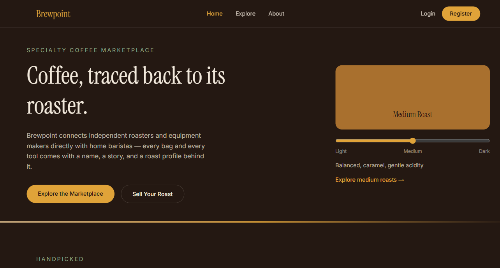

<div align="center">

# ☕ Brewpoint

### A specialty coffee marketplace — Next.js frontend for browsing, selling, and reviewing coffee beans, gear & accessories

[](https://nextjs.org/)
[](https://react.dev/)
[](https://www.typescriptlang.org/)
[](https://tailwindcss.com/)
[](https://brewpoint-drab.vercel.app)

[Live Site](https://brewpoint-drab.vercel.app) · [Backend API](https://github.com/SinghRohan333/server-brewpoint) · [Report Bug](https://github.com/SinghRohan333/brewpoint/issues)

</div>

<br />

<div align="center">
  
</div>

---

## 📖 About

**Brewpoint** is the client for a multi-vendor specialty coffee marketplace — independent roasters list beans, brewing equipment, and accessories; buyers browse, filter, and leave reviews. It's built on the **Next.js App Router**, mixing server-rendered product pages with fully client-driven browsing and dashboards, and talks to a custom Express/MongoDB API ([server-brewpoint](https://github.com/SinghRohan333/server-brewpoint)) for all data and auth.

It ships with its own dark, coffeehouse-inspired design system — espresso backgrounds, cream text, and warm gold accents — rather than a generic UI kit look.

---

## ✨ Features

**🛍️ Storefront & Discovery**

- Rich landing page: hero, category tiles, featured products, featured roasters, roast-level slider, how-it-works, testimonials, FAQ, newsletter signup
- **Explore page** with live search (debounced), category/price/rating/roast filters, sorting, and pagination — all synced to the URL so filtered views are shareable/bookmarkable
- Server-rendered product detail pages (always-fresh data) with an image gallery, specs, related products, and a reviews section

**🔐 Authentication**

- Email/password login & registration
- **Google Sign-In** via the Google Identity Services SDK
- Silent session restore on page load (calls the refresh endpoint, then fetches the current user) so refreshing the page never logs you out
- Protected routes for signed-in actions, with automatic redirect-back-after-login
- Toast notifications for auth feedback (`react-toastify`)

**📦 Selling**

- Authenticated users can list new products (`/items/add`) and manage their own listings (`/items/manage`)

**🛠️ Admin Dashboard**

- Role-gated `/admin` route (redirects non-admins with a toast)
- Platform stats cards, a users table (role management), and a products table with seller info

**🎨 Design**

- Custom Tailwind v4 theme (`espresso`, `espresso-light`, `cream`, `gold`, `sage`)
- Paired display serif (Instrument Serif) + sans (Inter) typography via `next/font`
- Fully responsive, with a dedicated mobile filter panel on Explore

---

## 🧰 Tech Stack

| Layer         | Technology                                                                                              |
| ------------- | ------------------------------------------------------------------------------------------------------- |
| Framework     | Next.js 16 (App Router)                                                                                 |
| UI Library    | React 19                                                                                                |
| Language      | TypeScript                                                                                              |
| Styling       | Tailwind CSS 4 (custom theme)                                                                           |
| Icons         | `lucide-react`, `react-icons`                                                                           |
| Notifications | `react-toastify`                                                                                        |
| Auth          | JWT access tokens + Google Identity Services                                                            |
| Deployment    | Vercel                                                                                                  |
| Backend       | [server-brewpoint](https://github.com/SinghRohan333/server-brewpoint) — Express + native MongoDB driver |

---

## 🗺️ Pages / Routes

| Route                          | Description                                                                    | Access        |
| ------------------------------ | ------------------------------------------------------------------------------ | ------------- |
| `/`                            | Landing page — hero, categories, featured products/roasters, testimonials, FAQ | Public        |
| `/explore`                     | Full product catalog with search, filters, sorting & pagination                | Public        |
| `/products/[id]`               | Product detail — gallery, specs, reviews, related items                        | Public        |
| `/login`                       | Email/password + Google sign-in                                                | Public        |
| `/register`                    | New account creation                                                           | Public        |
| `/items/add`                   | List a new product                                                             | 🔒 Signed in  |
| `/items/manage`                | Manage your own listings                                                       | 🔒 Signed in  |
| `/admin`                       | Stats, user management, product oversight                                      | 👑 Admin only |
| `/contact`                     | Contact form                                                                   | Public        |
| `/about`, `/terms`, `/privacy` | Static info pages                                                              | Public        |

---

## 🏗️ Project Structure

```
brewpoint/
├── public/
│   └── auth-panel.png
├── src/
│   ├── app/                        # Next.js App Router pages
│   │   ├── page.tsx                 # Home
│   │   ├── explore/page.tsx
│   │   ├── products/[id]/page.tsx
│   │   ├── items/add/page.tsx
│   │   ├── items/manage/page.tsx
│   │   ├── admin/page.tsx
│   │   ├── login/, register/
│   │   ├── contact/, about/, terms/, privacy/
│   │   └── layout.tsx               # Root layout — fonts, Navbar, Footer, AuthProvider
│   ├── components/
│   │   ├── home/                    # Hero, Categories, FeaturedProducts, Stats, FAQ...
│   │   ├── explore/                 # SearchBar, FilterPanel, SortSelect, Pagination
│   │   ├── product/                 # ImageGallery, ProductInfo, ReviewsSection...
│   │   ├── auth/                    # LoginForm, RegisterForm, GoogleButton, route guards
│   │   ├── admin/                   # StatsCards, UsersTable, AdminProductsTable
│   │   ├── items/                   # AddItemForm, ManageItemsList
│   │   └── layout/                  # Navbar, Footer
│   ├── context/
│   │   └── AuthContext.tsx          # Global auth state — login/register/Google/logout
│   ├── lib/
│   │   ├── api.ts                   # Typed fetch wrapper for the backend API
│   │   └── types.ts                 # Product, AdminUser, AdminProduct interfaces
│   └── hooks/
│       └── useDebouncedValue.ts
└── package.json
```

---

## 🔗 Connecting to the Backend

This frontend is a pure client for the [**server-brewpoint**](https://github.com/SinghRohan333/server-brewpoint) API — it holds no database logic of its own. All product, auth, review, and admin data flows through `lib/api.ts`, which wraps `fetch` with the base URL, JSON headers, and `credentials: "include"` (required for the refresh-token cookie).

On page load, `AuthContext` calls `POST /auth/refresh` to silently restore a session from the `httpOnly` cookie set by the backend, then fetches `/auth/me`.

---

## 🚀 Getting Started

### Prerequisites

- Node.js 18+
- The [backend API](https://github.com/SinghRohan333/server-brewpoint) running locally or deployed (this app is unusable without it)
- (Optional) A Google Cloud OAuth Client ID for Google sign-in

### Installation

```bash
git clone https://github.com/SinghRohan333/brewpoint.git
cd brewpoint
npm install
```

### Environment Variables

Create a `.env.local` file in the project root:

```env
# URL of the running server-brewpoint API
NEXT_PUBLIC_API_URL=http://localhost:5000/api

# Must match the backend's GOOGLE_CLIENT_ID
NEXT_PUBLIC_GOOGLE_CLIENT_ID=your_google_client_id
```

### Run locally

```bash
npm run dev
```

Open [http://localhost:3000](http://localhost:3000).

### Build for production

```bash
npm run build
npm start
```

---

## ☁️ Deployment

Deployed on **[Vercel](https://vercel.com)**:

🔗 **https://brewpoint-drab.vercel.app**

> Set `NEXT_PUBLIC_API_URL` and `NEXT_PUBLIC_GOOGLE_CLIENT_ID` as environment variables in your Vercel project settings — and make sure the backend's `CLIENT_URL` env var points back to this deployed domain so CORS and cookies work correctly.

---

## 📸 Screenshots

> More screenshots coming soon — home page, explore/filters, product detail, and admin dashboard.

---

## 🗺️ Roadmap

- [ ] Shopping cart & checkout flow
- [ ] User profile / order history page
- [ ] Wishlist / saved items
- [ ] Image upload UI (currently image URLs only, matching the backend)
- [ ] Dark/light theme toggle

---

## 👤 Author

**Rohan Singh**

- GitHub: [@SinghRohan333](https://github.com/SinghRohan333)

---

## 📄 License

This project is licensed under the **ISC License**.

<div align="center">

If you like this project, consider giving it a ⭐!

</div>
